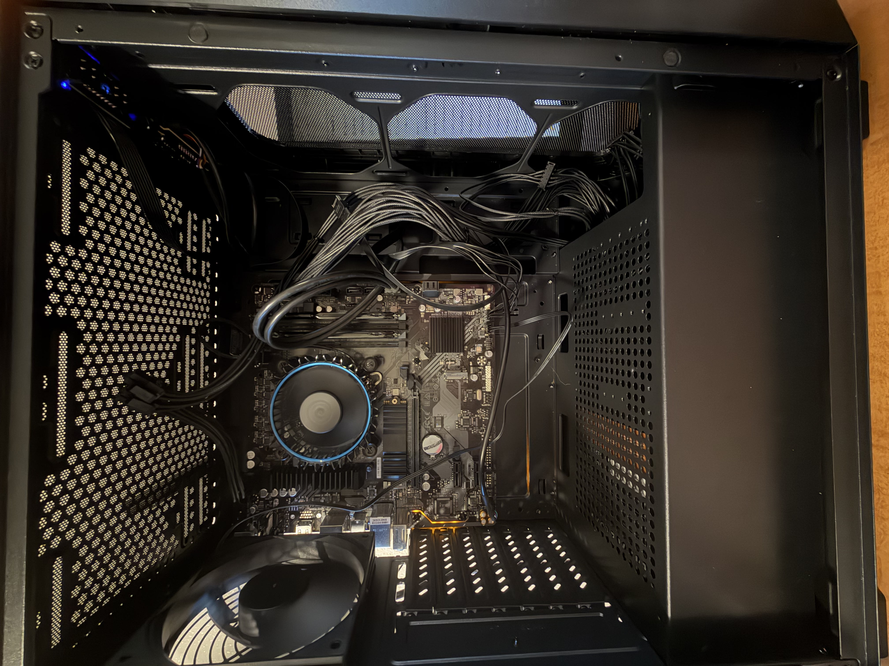

# pc-build-and-configuration
Custom PC build, Windows 11 installation, system configuration, driver setup, networking, troubleshooting, and testing.

## Project Overview
This project documents the process of building and configuring my first custom desktop computer. The goal was to gain hands-on experience with computer hardware installation, operating system deployment, device drivers, networking, and troubleshooting.

## Hardware Components
- **Motherboard:** GIGABYTE B760M DS3H AX DDR4
- **Processor:** Intel Core i5-12400
- **Graphics:** Intel UHD Graphics 730 (integrated — no dedicated GPU)
- **Memory:** 16GB DDR4 (2×8GB) 3200 MHz CL16
- **Storage:** Colorful CN600 512GB NVMe SSD (PCIe Gen3 M.2 2280)
- **Power Supply:** Montech BETA 2 650W, 80+ Bronze, ATX 3.1
- **Case:** DARKROCK EC2 Black ATX Mid Tower
- **CPU Cooler:** Intel Laminar RM1

## Assembly and Installation
- Installed the Intel Core i5-12400 processor into the motherboard's LGA 1700 socket.
- Installed the Intel Laminar RM1 CPU cooler and connected the cooler fan to the CPU_FAN header.
- Installed 16GB of DDR4 memory (2×8GB) in the recommended motherboard memory slots.
- Installed the 512GB NVMe SSD in the motherboard's M.2 slot and reattached the M.2 cover.
- Connected the 24-pin ATX motherboard power cable and the 8-pin CPU/EPS power cable.
- Connected the front-panel power switch, power LED, hard drive activity LED, and reset switch to the motherboard F_PANEL header.
- Connected the case fan to the motherboard SYS_FAN3 header.
- Attached the Wi-Fi antennas to the motherboard's rear I/O connections.

## Windows 11 Installation and Configuration
- Created a bootable Windows 11 installation USB using the Microsoft Media Creation Tool.
- Configured the BIOS/UEFI boot settings to start the Windows 11 installation from the USB drive.
- Installed Windows 11 on the 512GB NVMe SSD.
- Completed the Windows 11 initial setup, including system name, privacy settings, time zone, and Windows updates.

## Drivers and Networking
- Connected the system to the network using an Ethernet connection during setup.
- Identified the missing Wi-Fi driver using the device Hardware ID in Windows Device Manager.
- Installed the required Realtek Wi-Fi driver and verified that the wireless network connection was working correctly.
- Verified Ethernet and Wi-Fi connectivity after driver installation and system configuration.

## Troubleshooting
- Diagnosed a display problem caused by an HDMI-to-VGA connection and resolved it by switching to a direct HDMI-to-HDMI connection.
- Troubleshot missing Wi-Fi functionality by checking Device Manager, locating the device Hardware ID, installing the appropriate driver, and confirming successful wireless connectivity.
- Verified motherboard power, front-panel, CPU fan, and case fan connections during system setup and troubleshooting.

## Final Result
- Successfully completed the custom PC build and Windows 11 configuration, resulting in a fully operational system for everyday use.

## Skills Demonstrated
- Computer hardware installation and component integration
- BIOS/UEFI configuration and operating system installation
- Windows 11 installation, configuration, and updates
- Device driver identification, installation, and troubleshooting
- Ethernet and Wi-Fi network setup and connectivity testing
- Hardware and software troubleshooting

## Project Photo

  

   
